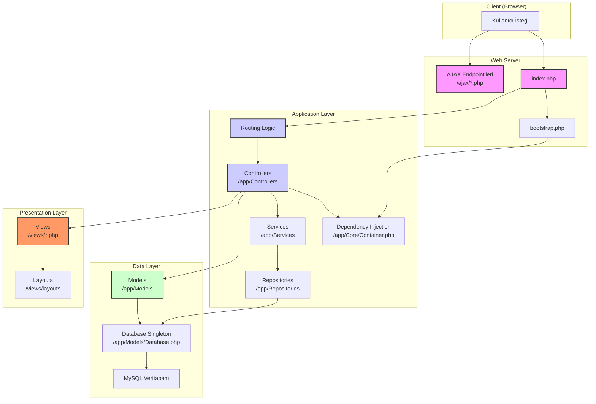

# Proje Mimarisi Raporu

Bu doküman, bütçe yönetim sisteminin mevcut teknik mimarisini, temel bileşenlerini ve veri akışını açıklamaktadır.

## 1. Genel Bakış

Proje, herhangi bir harici PHP framework'ü (örn. Laravel, Symfony) kullanmadan, "Vanilla PHP" ile geliştirilmiş bir web uygulamasıdır. Temel yapı, klasik Model-View-Controller (MVC) desenine benzer bir yaklaşım sergilemektedir. Composer, bağımlılık yönetimi ve PSR-4 standardında otomatik yükleme (autoloading) için kullanılmaktadır.

## 2. Mimari Diyagram

Aşağıdaki diyagram, sistemin ana bileşenleri arasındaki ilişkiyi ve temel istek akışını göstermektedir.

## 3. Katmanlar ve Bileşenler

### 3.1. Giriş Noktaları (Entry Points)

*   **`index.php`**: Ana senkron (sayfa yüklemesi) istekleri için birincil giriş noktasıdır. `bootstrap.php`'yi yükler ve temel bir yönlendirme (routing) mantığı içerir.
*   **`bootstrap.php`**: Uygulamanın çekirdek yapılandırmasını yapar. Composer autoloader'ı, session yönetimini, güvenlik başlıklarını, CSRF korumasını ve hata yakalama (error/exception handling) mekanizmalarını başlatır.
*   **`ajax/*.php`**: Asenkron (JavaScript) istekleri için ayrı giriş noktalarıdır. Her bir dosya, belirli bir AJAX işlemini (örn. `add_expense.php`) yönetir. Bu yapı, ana MVC akışından bağımsız çalışır.

### 3.2. Uygulama Katmanı (Application Layer)

*   **Routing (`index.php` içinde)**: URL'yi analiz eder ve isteği ilgili Controller sınıfına ve metoduna yönlendirir. Basit, dizi tabanlı bir eşleme (mapping) kullanır.
*   **Controllers (`app/Controllers`)**: HTTP isteklerini alır, iş mantığını koordine eder, Model katmanından veri talep eder ve sonucu View katmanına gönderir.
*   **Dependency Injection (`app/Core/Container.php`)**: Basit bir DI container, özellikle Servis ve Repository katmanları arasındaki bağımlılıkları yönetmek için kullanılır. Bu, kodun daha modüler ve test edilebilir olmasına yardımcı olur.
*   **Services (`app/Services`)**: Daha karmaşık iş mantığını veya birden fazla modeli koordine etmesi gereken operasyonları barındırır. (Örn: `ExpenseService`)
*   **Repositories (`app/Repositories`)**: Veritabanı sorgularını soyutlar. Controller'ların doğrudan veritabanı mantığıyla uğraşmasını engeller. (Örn: `ExpenseRepository`)

### 3.3. Veri Katmanı (Data Layer)

*   **Models (`app/Models`)**: Uygulamanın veri yapılarını ve iş kurallarını temsil eder. Bazı modeller (örn. `Dashboard.php`) doğrudan veritabanı sorguları içerirken, bazıları daha çok veri taşıma nesnesi (DTO) gibi davranır.
*   **Database (`app/Models/Database.php`)**: Veritabanı bağlantısını yöneten bir Singleton sınıfıdır. PDO kullanarak sorgu çalıştırma, veri çekme ve transaction yönetimi gibi temel işlevleri sağlar.

### 3.4. Sunum Katmanı (Presentation Layer)

*   **Views (`views`)**: HTML çıktısını oluşturan PHP dosyalarıdır. Controller'dan gelen verileri kullanarak kullanıcı arayüzünü render eder.
*   **Layouts (`views/layouts`)**: `layoutTop.php` ve `layoutBottom.php` gibi dosyalar, tüm sayfalarda ortak olan başlık (header), menü (sidebar) ve altbilgi (footer) gibi UI bileşenlerini içerir. Bu, kod tekrarını azaltır ve tutarlı bir görünüm sağlar.

## 4. Güçlü Yönler

*   **Basitlik:** Framework bağımlılığının olmaması, projenin anlaşılmasını ve temel PHP bilgisiyle geliştirme yapılmasını kolaylaştırır.
*   **Hafiflik:** Gereksiz kod ve bağımlılık içermediği için potansiyel olarak hızlı çalışır.
*   **Temel Güvenlik:** CSRF koruması, input sanitization ve güvenli session yönetimi gibi önemli güvenlik önlemleri mevcuttur.
*   **Soyutlama Çabası:** `Service` ve `Repository` katmanlarının varlığı, iş mantığı ile veri erişimini ayırma yönünde iyi bir niyet olduğunu göstermektedir.

## 5. Zayıf Yönler ve Geliştirme Alanları

*   **Tutarsız Mimari Uygulaması:**
    *   Bazı Controller'lar DI Container kullanırken, bazıları `new Model()` şeklinde doğrudan nesne yaratarak bağımlılıkları kendileri yönetiyor. Bu durum tutarsızlığa yol açar.
    *   `ajax/` dizinindeki betikler, ana MVC ve DI yapısını tamamen atlayarak kendi içlerinde mantık ve veritabanı erişimi barındırıyor. Bu, kod tekrarına ve bakım zorluklarına neden olur.
*   **İlkel Yönlendirme (Routing):** `index.php` içindeki yönlendirme mekanizması çok temeldir ve karmaşık URL yapılarını (örn. parametreler, RESTful desenler) desteklemekte zorlanabilir.
*   **Model Sorumlulukları:** Bazı Modeller hem veri yapısını temsil ediyor hem de doğrudan veritabanı sorguları içeriyor. Bu, Tek Sorumluluk Prensibi'ni (Single Responsibility Principle) ihlal edebilir.
*   **Test Edilebilirlik:** `ajax/` betiklerinin ve bağımlılıkları doğrudan yaratan Controller'ların birim (unit) testlerini yazmak zordur.